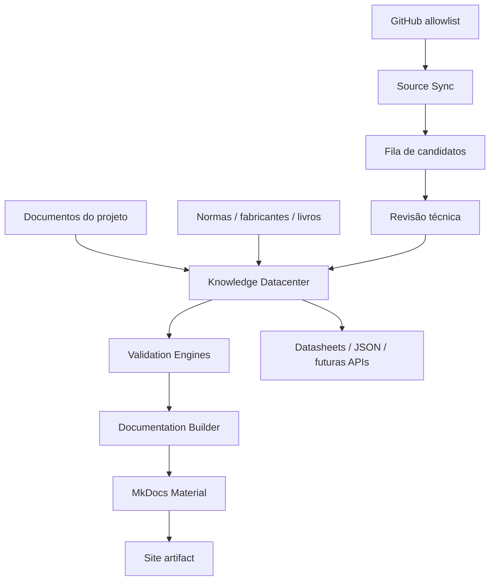

# Arquitetura do Digital Engineering Knowledge System

## Princípio

O DEKS adota uma arquitetura **data-centric**: dados estruturados são a fonte de verdade; páginas, índices e mapas são produtos gerados.

## Componentes

| Camada | Responsabilidade |
|---|---|
| `datacenter/` | fonte estruturada de conhecimento, estado e fontes |
| `schemas/` | contratos formais dos dados |
| `pipeline/` | validação, sincronização e geração |
| `datasheet/` | estrutura canônica de fichas técnicas |
| `docs/` | conteúdo manual e interface documental |
| `governance/` | regras, prompts e políticas |
| `.github/workflows/` | CI/CD, atualização e build |
| `tests/` | regressão e fiscalização automática |

## Fonte única de verdade

O conteúdo de um verbete nasce em `datacenter/GLOSSARY_MASTER.json`. O gerador cria páginas individuais, índice interativo, mapa de conhecimento, página de fontes e status do sistema.

## Estratégia de evolução

1. **v1** — glossário interativo, filtros, busca, mapa, proveniência e build automatizado.
2. **v2** — biblioteca SVG canônica, relacionamentos tipados e importadores de Instrument Index / I/O / C&E.
3. **v3** — grafo persistente e API.
4. **v4** — integração com P&ID inteligente/DEXPI e digital twin, quando os dados do projeto justificarem.

A progressão deve manter a solução mais simples possível em cada estágio.
