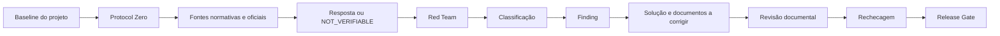

# Modelo de compatibilização de Automação

## Objetivo

O `AUTOMATION_COMPATIBILITY_REPORT_MODEL_V1_0` é o padrão reutilizável para análises de compatibilidade, auditorias e reavaliações de projetos de Automação.

O modelo transforma a Regra de Ouro em um contrato rastreável entre governança, Data Center, Data Sheet, schema, pipeline, testes e visualização.

## Fluxo obrigatório

## Estrutura do relatório

O relatório visual deve separar:

- perguntas resolvidas;
- perguntas abertas com campo de resposta;
- erros confirmados;
- problemas de engenharia;
- itens compatíveis;
- itens NOT_VERIFIABLE;
- arquitetura de Automação;
- rede e dados;
- lógica funcional;
- 24 Vcc / UPS quando aplicável;
- soluções;
- documentos a corrigir;
- plano de ação;
- Release Gate.

## Documentos envolvidos por finding

Todo finding confirmado registra quatro grupos:

| Grupo | Finalidade |
|---|---|
| `source_evidence` | documentos que comprovam a condição encontrada |
| `project_correlated_or_conflicting` | documentos do projeto relacionados ou conflitantes |
| `normative_or_reference` | normas, fontes oficiais ou referências técnicas |
| `documents_to_correct` | documentos que precisam ser revisados |

## Aplicabilidade normativa

Cada referência normativa recebe um estado:

- `APPLICABLE` — requisito aplicável ao projeto;
- `REFERENCE_ONLY` — referência de engenharia/documentação;
- `NOT_APPLICABLE` — fora do escopo;
- `PENDING` — aplicabilidade ainda não comprovada.

Uma fonte `REFERENCE_ONLY` não pode, por si só, transformar uma diferença em não conformidade confirmada.

## Biblioteca padrão

A biblioteca `datacenter/AUTOMATION_REFERENCE_LIBRARY.json` contém os metadados de consulta de:

- PETROBRAS N-1882 Rev. F;
- PETROBRAS N-1883 Rev. F;
- PETROBRAS N-2833 Rev. A.

A biblioteca é obrigatória para consulta, porém a aplicação é controlada por escopo e pelos documentos contratuais do projeto.

## Visualização

`/visualize` é a camada padrão. **Build Web Data Visualization** é a camada aprimorada quando estiver executável.

A mudança de renderer nunca pode alterar o conteúdo técnico, a evidência, a classificação ou o Release Gate.

## Bloqueios de liberação

O pacote permanece bloqueado quando houver, entre outros:

- finding crítico aberto;
- pergunta material não resolvida;
- baseline incompleta ou não reconciliada;
- proveniência ausente;
- finding sem documentos envolvidos;
- alegação normativa sem base de aplicabilidade;
- rastreabilidade de Automação insuficiente;
- arquitetura sem análise de viabilidade;
- revisão corrigida ainda não rechecada.

## Arquivos vinculados

- `governance/AUTOMATION_COMPATIBILITY_REPORT_MODEL_v1_0.md`
- `governance/AUTOMATION_HYPERFOCUS_GOLDEN_RULE_v1_0.md`
- `datacenter/AUTOMATION_COMPATIBILITY_REPORT_MODEL.json`
- `datacenter/AUTOMATION_REFERENCE_LIBRARY.json`
- `schemas/engineering_compatibility.schema.json`
- `datasheet/ENGINEERING_COMPATIBILITY_DATA_SHEET.json`
- `pipeline/engineering_compatibility_gate.py`
- `pipeline/protocol_zero_gate.py`
- `tests/test_automation_report_model.py`
