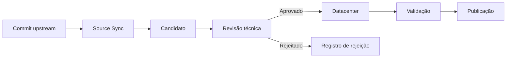

# Governança do conhecimento

## Autoridade técnica

O DEKS separa claramente **conteúdo técnico** de **tooling**.

A autoridade segue esta ordem:

1. documentos aprovados do projeto;
2. padrões gráficos e critérios do empreendimento;
3. listas, lógicas, C&E, I/O, datasheets e memoriais;
4. normas oficiais e legislação;
5. documentação oficial de fabricantes;
6. livros técnicos e artigos acadêmicos;
7. GitHub/open source.

## Mudanças externas

Mudança upstream **não** altera automaticamente definição técnica, tag, requisito normativo ou filosofia de controle.

## Controle de mudanças

Mudanças estruturais devem seguir branch e pull request. O CI precisa validar dados, schemas, testes e build documental antes de merge.

## Rastreabilidade

Cada verbete deve manter referência de fonte, classe de evidência, status e data de revisão. Quando houver conflito entre fontes, o sistema registra a condição em vez de escolher silenciosamente uma interpretação.

## Gate de aplicabilidade normativa

A existência de uma norma na biblioteca técnica não significa que ela seja mandatória para todo projeto. Cada referência recebe estado de aplicabilidade: `APPLICABLE`, `REFERENCE_ONLY`, `NOT_APPLICABLE` ou `PENDING`.

Uma referência `REFERENCE_ONLY` pode orientar boa prática e qualidade documental, mas não pode, isoladamente, sustentar uma não conformidade confirmada.

A biblioteca padrão de Automação está em `datacenter/AUTOMATION_REFERENCE_LIBRARY.json` e inclui N-1882, N-1883 e N-2833 com suas regras de escopo.

## Modelo de compatibilização de Automação

O modelo permanente `AUTOMATION_COMPATIBILITY_REPORT_MODEL_V1_0` vincula Protocol Zero, documentos envolvidos, rastreabilidade TAG/I-O/lógica/rede/dados, /visualize e Release Gate. Consulte [Modelo de compatibilização de Automação](automation-compatibility-model.md).
