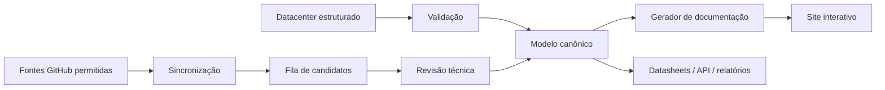

# Digital Engineering Knowledge System

O **DEKS** transforma o glossário de engenharia em uma base interativa, pesquisável e rastreável. A fonte técnica permanece no datacenter estruturado; este site é uma visualização gerada e controlada por CI.

  <a class="deks-hero-card" href="generated/glossary/index/">
    <strong>Glossário interativo</strong>
    Pesquisar termos, tags, funções e disciplinas.
  </a>
  <a class="deks-hero-card" href="generated/knowledge-map/">
    <strong>Mapa de conhecimento</strong>
    Navegar pelas relações entre objetos de engenharia.
  </a>
  <a class="deks-hero-card" href="generated/sources/">
    <strong>Fontes e proveniência</strong>
    Ver origem, papel e estado das fontes monitoradas.
  </a>
  <a class="deks-hero-card" href="generated/status/">
    <strong>Estado do sistema</strong>
    Ver validação, avisos e candidatos pendentes.
  </a>

## Como o sistema funciona

!!! warning "Regra de autoridade"
    GitHub é usado para tooling, software, modelos, validação e automação. Não substitui documentos aprovados do projeto, normas oficiais ou critérios de engenharia.

## Estado de maturidade

A versão atual entrega a fundação do sistema: datacenter, validação, geração automática, busca, filtros, mapa de relações, rastreabilidade de fontes e build reprodutível no GitHub Actions.
