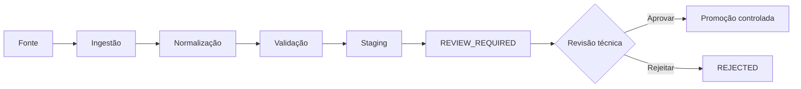

# DEKS v1.1 — Knowledge Ingestion

A camada de **Knowledge Ingestion** recebe dados estruturados, normaliza registros e os envia para revisão técnica antes de qualquer promoção ao datacenter canônico.

## Fluxo



!!! warning "Regra de governança"
    Ingestão não é aprovação. O pipeline nunca gera `APPROVED` automaticamente.

## Fontes registradas

O arquivo `datacenter/INGESTION_SOURCE_REGISTRY.json` controla as fontes de entrada, o nível de autoridade, a classe de evidência padrão, os formatos e os tipos de entidade permitidos.

As fontes inicialmente registradas cobrem:

- Glossário Mestre Rev4.2;
- AUTOMAÇÃO DM R00-05;
- P&ID / fluxogramas de projeto;
- Instrument Index;
- I/O List;
- Cause & Effect;
- datasheets.

Enquanto o arquivo de origem correspondente não estiver disponibilizado no repositório ou por processo de ingestão controlado, a fonte permanece `REGISTERED_PENDING_FILE` e `enabled = false`.

## Tipos de entidade v1.1

| Tipo | Uso |
|---|---|
| `glossary_entry` | verbetes técnicos |
| `tag` | tags e identificação |
| `symbol` | símbolos e metadados |
| `pid_object` | objetos do P&ID |
| `instrument_index_item` | registros do Instrument Index |
| `io_item` | sinais da I/O List |
| `cause_effect` | causas, efeitos e intertravamentos |
| `datasheet` | dados estruturados de datasheets |
| `source` | metadados de fonte |

## Formatos aceitos

Na v1.1 o motor aceita entradas estruturadas em **JSON** e **CSV**.

### JSON

```json
{
  "records": [
    {
      "entity_type": "tag",
      "external_id": "PT-101",
      "payload": {"tag": "PT-101"},
      "provenance": {"sheet": "1"}
    }
  ]
}
```

### CSV

Campos de controle suportados:

- `entity_type`;
- `external_id`;
- `evidence_class`;
- `payload_json`;
- `provenance_json`.

Outras colunas podem ser incorporadas ao `payload` quando `payload_json` não for utilizado.

## Saídas

Uma ingestão válida produz:

1. lote normalizado com `batch_id` e `ingestion_id` determinísticos;
2. staging em `ingestion/staging/` quando o caminho padrão é usado;
3. itens adicionados à fila `datacenter/INGESTION_REVIEW_QUEUE.json`;
4. `datacenter/INGESTION_STATUS.json` com o resultado do motor.

## Comandos

Validar apenas o registro de fontes:

```bash
python pipeline/knowledge_ingestion.py --validate-registry
```

Executar ingestão estruturada:

```bash
python pipeline/knowledge_ingestion.py \
  --input caminho/entrada.json \
  --source-id SOURCE_ID \
  --source-revision R00
```

## Promoção

A promoção de itens revisados para `GLOSSARY_MASTER.json` ou outros datacenters será tratada por um processo separado. A v1.1 deliberadamente termina na fila de revisão para impedir que parsing, OCR, CSV ou software externo sejam confundidos com aprovação de engenharia.
